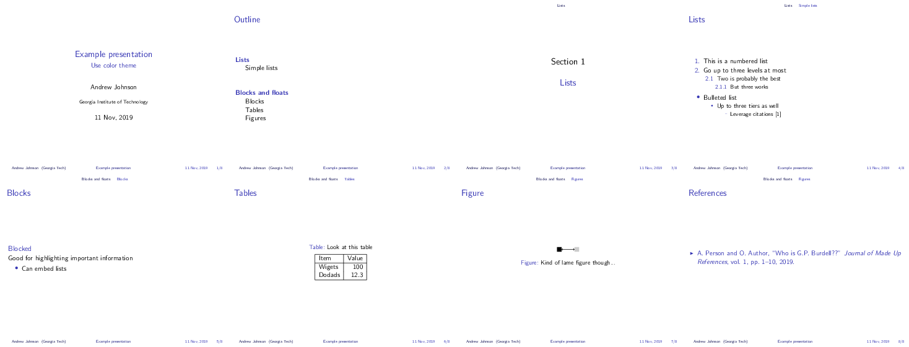

#  Georgia Tech-esque Beamer Templates

**Note** This project is not sponsored by nor endorsed by Georgia Institute of
Technology nor the city of Atlanta, GA.

This repository contains two style files needed to make a Beamer presentation
that contains elements inspired by Georgia Institute of Technology. The names
are chosen following the tradition of naming beamer themes after cities
and colors after animals. The colors in ``beamercolorthemeyellowjacket.sty``
follows the [Georgia Institute of Technology Branding Guide](https://comm.gatech.edu/brand/colors).

Source files are made available under the LaTeX project public license,
which can always be found at https://www.latex-project.org/lppl.txt

## Usage

Place these style files somewhere that your LaTeX builder (e.g. ``pdflatex``)
can find. The easiest way is to place ``beamercolorthemeyellowjacket.sty``
and ``beamerthemeatlanta.sty`` in the same directory as your presentation.
In order to instruct ``beamer`` to use these styles, add one or both
of the following lines to your preamble
```latex
\usetheme{atlanta}  % Georgia Tech-esque formatting
\usecolortheme{yellowjacket}  % Colors inspired by Georgia Tech
```

## Examples


**Color and structure theme**


**Just the coloring**


**Just the outer theme / structure** 

## License
This work may be distributed and/or modified under the
conditions of the LaTeX Project Public License, either version 1.3
of this license or (at your option) any later version.
The latest version of this license is in
  http://www.latex-project.org/lppl.txt
and version 1.3 or later is part of all distributions of LaTeX
version 2005/12/01 or later.

This work has the LPPL maintenance status `maintained'.

The Current Maintainer of this work is Andrew Johnson

This work consists of the files 
- beamercolorthemeyellowjacket.sty
- beamerthemeatlanta.sty
